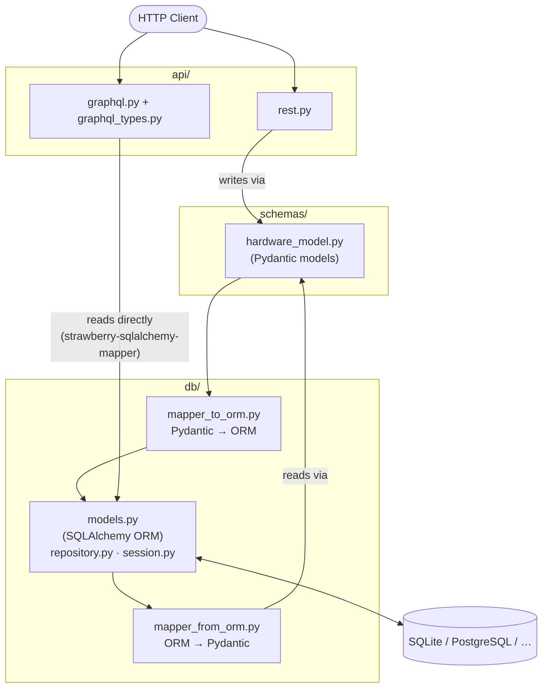

# Qupboard GraphQL / REST API

## Introduction

Qupboard is a proof-of-concept service for storing and serving **hardware calibration models** via
both a GraphQL and a REST API. It is built with:

- **[FastAPI](https://fastapi.tiangolo.com/)** – HTTP framework for the REST and GraphQL routers
- **[Strawberry](https://strawberry.rocks/)** – GraphQL schema and query engine
- **[SQLAlchemy](https://www.sqlalchemy.org/)** – ORM and database abstraction
- **[Alembic](https://alembic.sqlalchemy.org/)** – database schema migrations
- **[Pydantic](https://docs.pydantic.dev/)** – request/response validation and serialisation

The default backing store is SQLite (`qupboard.db`), configured via the `DATABASE_URL` environment
variable, but because we use SQLAlchemy, many other database engines may be used (postgres, MySQL,
MariaDB etc).

______________________________________________________________________

## Getting Started

### Prerequisites

- Python 3.12 or 3.13
- [Poetry](https://python-poetry.org/) (dependency and virtual environment management)

### Installation

Clone the repository and install all dependencies (including dev dependencies) into a local virtual
environment:

```bash
git clone <repo-url>
cd qupboard_graphql
poetry install --with dev
```

> The virtual environment is created in-project at `.venv/` (configured in `poetry.toml`).

### Configuration

The application is configured via environment variables. All settings have sensible defaults so no
configuration is required to run locally:

| Variable       | Default                   | Description                        |
| -------------- | ------------------------- | ---------------------------------- |
| `DATABASE_URL` | `sqlite:///./qupboard.db` | SQLAlchemy database URL            |
| `GRAPHQL_PATH` | `/graphql`                | Path for the GraphQL endpoint      |
| `REST_PATH`    | `/rest`                   | Path prefix for the REST endpoints |

To override a setting, export it before running the application:

```bash
export DATABASE_URL="sqlite:///./my_custom.db"
```

### Database setup

Before running the application for the first time, apply all Alembic migrations to initialise the
database schema:

```bash
poetry run alembic upgrade head
```

### Running the application

Start the server using the installed `qupboard` script:

```bash
poetry run qupboard
```

or alternatively, run the FastAPI app directly (assuming you are in the project root and have
installed dependencies into a virtual environment):

```bash
./src/qupboard_graphql/main.py
```

The server starts on `http://0.0.0.0:8000`. The following endpoints are then available:

| URL                             | Description                            |
| ------------------------------- | -------------------------------------- |
| `http://localhost:8000/graphql` | GraphQL API + interactive GraphiQL IDE |
| `http://localhost:8000/rest`    | REST API                               |
| `http://localhost:8000/docs`    | OpenAPI / Swagger UI                   |

### Running the tests

The test suite uses [pytest](https://pytest.org/) with an in-memory SQLite database so no prior
database setup is required.

Run all tests:

```bash
poetry run pytest
```

Run tests in parallel (faster):

```bash
poetry run pytest -n auto
```

Run with coverage:

```bash
poetry run pytest --cov=qupboard_graphql --cov-report=term-missing
```

______________________________________________________________________

## Project Structure

```
qupboard_graphql/
├── pyproject.toml                  # Project metadata and dependencies
├── alembic.ini                     # Alembic configuration
├── alembic/
│   ├── env.py                      # Migration environment (wired to ORM models)
│   └── versions/                   # Generated migration scripts
├── qupboard.db                     # Default SQLite database
├── src/
│   └── qupboard_graphql/
│       ├── main.py                 # Entrypoint – starts uvicorn on 0.0.0.0:8000
│       ├── config.py               # Pydantic settings (DATABASE_URL, API paths)
│       ├── api/
│       │   ├── app.py              # FastAPI application factory
│       │   ├── graphql_types.py    # Strawberry type declarations (StrawberrySQLAlchemyMapper + @mapper.type classes)
│       │   ├── graphql.py          # Query resolvers, schema, and GraphQL router
│       │   ├── rest.py             # REST router (CRUD for hardware models)
│       │   └── root.py             # Health-check and root redirect routes
│       ├── db/
│       │   ├── database.py         # SQLAlchemy DeclarativeBase
│       │   ├── repository.py       # RepositoryMixin (get_by_uuid, get_all_pks)
│       │   ├── models.py           # ORM models mirroring the hardware model schema
│       │   ├── mapper_from_orm.py  # ORM → Pydantic conversion helpers
│       │   ├── mapper_to_orm.py    # Pydantic → ORM conversion helpers
│       │   └── session.py          # Engine, SessionLocal, and get_db dependency
│       └── schemas/
│           └── hardware_model.py   # Pydantic schema for HardwareModel
└── tests/
    ├── conftest.py
    ├── test_graphql.py
    ├── test_rest.py
    └── data/                       # Sample calibration JSON fixtures
```

______________________________________________________________________

## Architecture

### Layers

The application is split into four distinct layers, each with a clear responsibility and minimal
coupling to the others:

- **API layer** (`api/`) – FastAPI routers for REST and GraphQL endpoints, plus the GraphQL schema
  and resolvers.
- **Schema layer** (`schemas/`) – Pydantic models defining the hardware model schema used for
  request validation and serialisation in the REST API.
- **Database layer** (`db/`) – SQLAlchemy ORM models, database session management, and mapping
  helpers to convert between the Pydantic schema and the ORM models.
- **DB Engine** – the actual database engine (SQLite by default, but configurable via
  `DATABASE_URL`).



### Request flow

**REST write** (`POST /rest/logical-hardware`):

1. FastAPI parses the JSON body into a Pydantic `HardwareModel`.
1. `mapper_to_orm` converts it into a tree of SQLAlchemy ORM objects.
1. The ORM objects are committed to the database and the new UUID is returned.

**REST read** (`GET /rest/logical-hardware/{uuid}`):

1. `HardwareModelORM.get_by_uuid` fetches the row (and all related rows via eager-loaded
   relationships).
1. `mapper_from_orm` reconstructs the full Pydantic `HardwareModel` and FastAPI serialises it to
   JSON.

**GraphQL read** (`getCalibration`, `getAllCalibrations`):

1. Strawberry calls the resolver, which fetches the ORM row(s) directly.
1. `strawberry-sqlalchemy-mapper` translates the ORM objects into Strawberry types on the fly — no
   manual mapping step required.

The GraphQL path therefore bypasses the Pydantic `schemas/` layer entirely; the Pydantic layer is
only used by the REST API and the ORM mappers. This means the database schema is effectively the
source of truth for the GraphQL API: any change to the ORM models is immediately reflected in the
GraphQL schema, with no separate mapping step required.

The REST API is more decoupled from the database schema — the Pydantic models and manual mappers act
as an explicit translation layer, giving the REST interface the freedom to evolve independently of
the underlying data model. This makes the REST surface better suited to a stable, versioned contract
for existing clients, while the GraphQL interface can track the database schema more closely and
change more rapidly.

Note that `strawberry-sqlalchemy-mapper` generates Strawberry types directly from the ORM models and
wires up relationship fields as paginated connections (hence the `edges { node { … } }` shape seen
in the example queries). Generic field-level filtering is not provided automatically; any
specialised queries (for example, fetching a subset of the qubits filtered by fidelity belonging to
a particular QPU) would still be written as custom resolvers that return ORM objects in the same
connection-style shape, leaving clients free to select whichever fields they need.

______________________________________________________________________

## Known Limitations / Not Implemented

This is a proof-of-concept service. The following are notable omissions that would be required in a
production-grade version:

### DataLoaders (N+1 query problem)

The GraphQL resolvers fetch related ORM objects via SQLAlchemy eager-loading, but this is done
naively per-root-object. When fetching multiple calibrations each with many qubits, pulse channels,
etc., this can produce an **N+1 query pattern**. A real service would use
[Strawberry DataLoaders](https://strawberry.rocks/docs/guides/dataloaders) (backed by
[`aiodataloader`](https://github.com/syrusakbary/aiodataloader) or similar) to batch and cache
database lookups within a single request.

### Authentication & Authorisation

There is no authentication or authorisation. A production service would require at minimum:

- **Authentication** – e.g. OAuth 2.0 / OIDC JWT bearer tokens, API keys, or mutual TLS.
- **Authorisation** – role-based or attribute-based access control to restrict which clients can
  read or write which hardware models.

### GraphQL Mutations

The GraphQL API is currently read-only. A real service would expose **mutations** for creating,
updating, and deleting hardware models, with appropriate input validation mirroring what the REST
`POST` endpoint does today.

### Pagination

The `getAllCalibrations` resolver returns all rows without limit. For large datasets this is
unacceptable. Real resolvers should support **cursor-based pagination** (the connection-style edges
/ node shape already generated by `strawberry-sqlalchemy-mapper` is designed for this, but the root
resolvers do not yet pass `first` / `after` arguments through to the database query).

### Input Validation on the GraphQL Layer

Pydantic validation is only applied on the REST path. GraphQL mutations (once added) should perform
equivalent validation. Strawberry supports Pydantic integration via
`strawberry.experimental.pydantic` that could be used to share the schema definitions.

### Async Database Access

The application uses a synchronous SQLAlchemy session (`SessionLocal`) served via FastAPI's
`run_in_threadpool`. A production service under concurrent load should use SQLAlchemy's async engine
(`create_async_engine` + `AsyncSession`) together with an async-compatible driver (e.g. `aiosqlite`
for SQLite, `asyncpg` for PostgreSQL) to avoid blocking the event loop.

### Caching

Frequently-read calibration models are re-fetched from the database on every request. A caching
layer (e.g. Redis with an appropriate TTL, or an in-process LRU cache invalidated on write) would
dramatically reduce database load for read-heavy workloads.

### Observability

There is no structured logging, metrics, or distributed tracing. A production service should emit:

- **Structured logs** (e.g. via `structlog`) including request IDs for correlation.
- **Metrics** (e.g. Prometheus counters/histograms via `prometheus-fastapi-instrumentator`).
- **Traces** (e.g. OpenTelemetry spans covering HTTP requests and database queries).

### Database Connection Pooling & Configuration

The current SQLite default is not suitable for production. When switching to PostgreSQL or another
server-side database, connection pool settings (`pool_size`, `max_overflow`, `pool_timeout`) should
be tuned and exposed via configuration, and a connection health-check (`pool_pre_ping=True`) should
be enabled.

### REST API Versioning

The REST endpoints have no version prefix (e.g. `/v1/rest/…`). A stable public API should be
versioned from the start to allow breaking changes to be introduced without disrupting existing
clients.

### Error Handling

Unhandled exceptions propagate as generic 500 responses with minimal detail. A real service would
map domain errors (e.g. "model not found", "validation failed", "database constraint violated") to
well-structured error responses with appropriate HTTP status codes, and equivalent
[GraphQL error extensions](https://strawberry.rocks/docs/guides/errors) for the GraphQL path.

______________________________________________________________________

## Downloading the GraphQL Schema

For general playing, it's best to simply use the interactive GraphiQL IDE at
`http://localhost:8000/graphql` to explore the schema and test queries. However, for programmatic
access to the schema (e.g. for code generation or client development), there are several ways to
download it from the GraphQL endpoint once the server is running.

### Option 1 – Strawberry CLI (recommended)

Strawberry can export the schema directly from the Python module without starting the server:

```bash
poetry run strawberry export-schema qupboard_graphql.api.graphql:schema
```

### Option 2 – Introspection query via `curl`

Send a standard GraphQL introspection query to the running server:

```bash
curl -s -X POST http://localhost:8000/graphql \
     -H "Content-Type: application/json" \
     -d '{"query": "{ __schema { types { name } } }"}' | jq
```

To retrieve the full schema definition, use the standard introspection query:

```bash
curl -s -X POST http://localhost:8000/graphql \
     -H "Content-Type: application/json" \
     -d @- <<'EOF'
{
  "query": "query IntrospectionQuery { __schema { queryType { name } mutationType { name } subscriptionType { name } types { ...FullType } directives { name description locations args { ...InputValue } } } } fragment FullType on __Type { kind name description fields(includeDeprecated: true) { name description args { ...InputValue } type { ...TypeRef } isDeprecated deprecationReason } inputFields { ...InputValue } interfaces { ...TypeRef } enumValues(includeDeprecated: true) { name description isDeprecated deprecationReason } possibleTypes { ...TypeRef } } fragment InputValue on __InputValue { name description type { ...TypeRef } defaultValue } fragment TypeRef on __Type { kind name ofType { kind name ofType { kind name ofType { kind name ofType { kind name ofType { kind name ofType { kind name } } } } } } }"
}
EOF
```

## Example Queries

### GraphQL

The GraphQL API is available at `/graphql`. An interactive GraphQL IDE is served at the same path in
a browser.

**Fetch a calibration by ID**

```graphql
{
  getCalibration(id: "d8b81172-fb8d-43f7-92dd-aff4dbc1defb") {
    id
    version
    calibrationId
    logicalConnectivity
    qubits {
      edges {
        node {
          uuid
          qubitKey
          meanZMapArgs
          discriminatorReal
          discriminatorImag
          directXPi
          phaseCompXPi2
          physicalChannel {
            uuid
            channelKind
            nameIndex
            blockSize
            defaultAmplitude
            switchBox
            swapReadoutIq
            basebandUuid
            basebandFrequency
            basebandIfFrequency
            iqBias
          }
          resonator {
            uuid
            physicalChannel {
              uuid
              channelKind
              nameIndex
              blockSize
              defaultAmplitude
              switchBox
              swapReadoutIq
              basebandUuid
              basebandFrequency
              basebandIfFrequency
              iqBias
            }
            pulseChannels {
              edges {
                node {
                  uuid
                  channelRole
                  frequency
                  imbalance
                  phaseIqOffset
                  scaleReal
                  scaleImag
                  acqDelay
                  acqWidth
                  acqSync
                  acqUseWeights
                  resetDelay
                  pulse {
                    id
                    waveformType
                    width
                    amp
                    phase
                    drag
                    rise
                    ampSetup
                    stdDev
                  }
                }
              }
            }
          }
          pulseChannels {
            edges {
              node {
                uuid
                channelRole
                frequency
                imbalance
                phaseIqOffset
                scaleReal
                scaleImag
                ssActive
                ssDelay
                fsActive
                fsAmp
                fsPhase
                resetDelay
                pulse {
                  id
                  waveformType
                  width
                  amp
                  phase
                  drag
                  rise
                  ampSetup
                  stdDev
                }
                pulseXPi {
                  id
                  waveformType
                  width
                  amp
                  phase
                  drag
                  rise
                  ampSetup
                  stdDev
                }
              }
            }
          }
          crossResonanceChannels {
            edges {
              node {
                uuid
                role
                auxiliaryQubit
                frequency
                imbalance
                phaseIqOffset
                scaleReal
                scaleImag
                zxPi4Pulse {
                  id
                  waveformType
                  width
                  amp
                  phase
                  drag
                  rise
                  ampSetup
                  stdDev
                }
              }
            }
          }
          crossResonanceCancellationChannels {
            edges {
              node {
                uuid
                role
                auxiliaryQubit
                frequency
                imbalance
                phaseIqOffset
                scaleReal
                scaleImag
              }
            }
          }
          zxPi4Comps {
            edges {
              node {
                uuid
                auxiliaryQubit
                phaseCompTargetZxPi4
                pulseZxPi4TargetRotaryAmp
                precompActive
                postcompActive
                useSecondState
                useRotary
                pulsePrecomp {
                  id
                  waveformType
                  width
                  amp
                  phase
                  drag
                  rise
                  ampSetup
                  stdDev
                }
                pulsePostcomp {
                  id
                  waveformType
                  width
                  amp
                  phase
                  drag
                  rise
                  ampSetup
                  stdDev
                }
              }
            }
          }
        }
      }
    }
  }
}
```

**List all stored hardware model IDs**

```graphql
{
  getAllHardwareModelIds
}
```

**Fetch all calibrations**

```graphql
{
  getAllCalibrations {
    id
    version
    calibrationId
  }
}
```

______________________________________________________________________

### REST

The REST API is available at `/rest`. Interactive OpenAPI docs are served at `/docs`.

| Method | Path                            | Description                                        |
| ------ | ------------------------------- | -------------------------------------------------- |
| `GET`  | `/healthcheck`                  | Health check – returns `OK`                        |
| `GET`  | `/rest/logical-hardware`        | List all hardware model UUIDs                      |
| `GET`  | `/rest/logical-hardware/{uuid}` | Fetch a hardware model by UUID                     |
| `POST` | `/rest/logical-hardware`        | Create a hardware model from a JSON body           |
| `POST` | `/rest/logical-hardware/upload` | Create a hardware model from an uploaded JSON file |

**List all hardware model IDs**

```bash
curl http://localhost:8000/rest/logical-hardware
```

**Fetch a specific hardware model**

```bash
curl http://localhost:8000/rest/logical-hardware/92f4847b-4df2-4c04-9fbc-18c9228b78ab
```

**Create a hardware model from a JSON body**

```bash
curl -X POST http://localhost:8000/rest/logical-hardware \
     -H "Content-Type: application/json" \
     -d @path/to/calibration.json
```

**Upload a hardware model from a file**

```bash
curl -X POST http://localhost:8000/rest/logical-hardware/upload \
     -F "file=@path/to/calibration.json;type=application/json"
```

______________________________________________________________________

## Database Implementation

### Schema

The database schema mirrors the `HardwareModel` Pydantic schema and is defined as SQLAlchemy ORM
models in `src/qupboard_graphql/db/models.py`. The table hierarchy is:

```
hardware_models
└── qubits
    ├── physical_channels      (channel_kind = 'qubit'; baseband + IQ-bias inlined)
    ├── pulse_channels         (channel_role discriminator; qubit-owned channels only)
    │   channel_role values:
    │     'drive'            – qubit drive channel
    │     'second_state'     – second-state channel (ss_active, ss_delay)
    │     'freq_shift'       – freq-shift channel   (fs_active, fs_amp, fs_phase)
    │     'reset_qubit'      – qubit reset channel  (reset_delay)
    │   └── calibratable_pulses (owner_uuid + pulse_role discriminator)
    ├── cross_resonance_channels (role = 'cr' | 'crc')
    │   └── calibratable_pulses  (pulse_role = 'cr')
    ├── phase_comp_x_pi_2      (inlined column on qubits)
    ├── zx_pi_4_comps          (one per CR pair)
    │   └── calibratable_pulses (pulse_role = 'zx_precomp' | 'zx_postcomp', nullable)
    └── resonators             (one-to-one with qubit)
        ├── physical_channels  (channel_kind = 'resonator'; baseband + IQ-bias inlined)
        └── pulse_channels     (channel_role discriminator; resonator-owned channels only)
            channel_role values:
              'measure'        – resonator measure channel
              'acquire'        – resonator acquire channel (acq_delay/width/sync/use_weights)
              'reset_resonator'– resonator reset channel   (reset_delay)
            └── calibratable_pulses (owner_uuid + pulse_role discriminator)
```

The database URL defaults to `sqlite:///./qupboard.db` and can be overridden with the `DATABASE_URL`
environment variable.

### Migrations with Alembic

Schema migrations are managed with [Alembic](https://alembic.sqlalchemy.org/). The Alembic project
lives at the **project root**:

```
alembic.ini          # Alembic configuration
alembic/
├── env.py           # Wired to ORM Base metadata and app settings
└── versions/        # Migration scripts
```

`env.py` automatically reads `DATABASE_URL` from the application settings, so no manual URL
configuration is required. `render_as_batch=True` is enabled to support SQLite's limited
`ALTER TABLE` capabilities.

All commands below assume they are run from the **project root**.

**Apply all pending migrations**

```bash
poetry run alembic upgrade head
```

**Check whether the database is up to date**

```bash
poetry run alembic check
```

**Show the current revision**

```bash
poetry run alembic current
```

**Generate a new migration after changing ORM models**

```bash
poetry run alembic revision --autogenerate -m "describe_your_change"
```

**Downgrade one revision**

```bash
poetry run alembic downgrade -1
```

**Stamp an existing database without running migrations** (useful when the schema was created
outside of Alembic)

```bash
poetry run alembic stamp head
```
